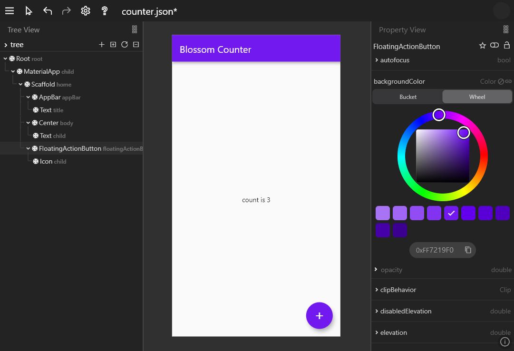

# flutter_blossom 🌼

[](https://liberapay.com/sanihaq/donate)
[](https://github.com/sanihaq)
[](https://github.com/flutter-blossom/flutter_blossom/releases)

> A low code editor with the full power of flutter. 



Think in flutter, watch your ideas come to life, plan ahead and let your creativity run loose. Flutter Blossom 🌸 is here to give all the developers free access to the Pandora's box.

Checkout pre-release on [web](https://sanihaq.github.io/flutter_blossom/) or [download](https://github.com/flutter-blossom/flutter_blossom/releases) desktop version.

### How to install

1. Download the latest platform specific `archive` file from [Releases](https://github.com/flutter-blossom/flutter_blossom/releases).
2. Extract or Open with any archive extractor. (e.g. [7zip](https://www.7-zip.org/))
3. Move everything to a suitable location.
4. Make a shortcut of the launcher `flutter_blossom` for easy access.

## Support
Flutter Blossom is created to make flutter development more easy and accessible. 

Developers can see and play with their ideas before committing fully. 
To make the process fun, intuitive and fast.

To reach these goals, I'll need your support.

[](https://liberapay.com/sanihaq/donate)
[](https://ko-fi.com/sanihaq)


## Todo

 - [x] Support web(not all features are available due to file_selector_web)
 - [x] Support desktop
 - [x] dark theme
 - [ ] light theme
 - [x] Canvas - support different devices
 - [x] Multi language ready (l10n)
 - [x] Support All Widget Type (currently ongoing)
 - [x] Conditional tree (currently supports: if..else)
 - [ ] Break Nodes into different segments and reuse in different part of tree.
 - [ ] App view to see full app on action
 - [ ] Support All Property Type (ongoing)
 - [ ] Get Property Value from other parts of tree 
 - [ ] load external assets (images, fonts etc.)
 - [ ] help section, docs, guides and example projects
 - [ ] mock data
 - [ ] mock api
 - [ ] real api (e.g. hacker-news)
 - [ ] Externals service support (e.g. Firebase)
 - [ ] Support Screenshot
 - [ ] share blossom project as library and load its trees to use as component
 - [ ] export to code
 - [ ] export blossom project to flutter project
 - [ ] export as package library
 - [ ] auto update app(currently supports: update available notification)
 - [ ] write test


## Code Contribution
### setup locally
  ```sh
  git clone https://github.com/flutter-blossom  flutter_blossom.git
  git submodule init
  git submodule update
  ```

  then
  ```sh
  dart pub global activate -sgit https://github.com flutter-blossom/blossom_cli.git
  blossom switch-to local
  ```
  finally
  - `flutter run <device>`
### update dependencies
  to add
  ```sh
  blossom add better_print: ^1.3.1
  ```
  to remove
  ```sh
  blossom remove better_print
  ```

<a href = "https://github.com/flutter-blossom/flutter_blossom/graphs/contributors">

</a>

#
 

